<p align="center">
  <h1 align="center">智慧社区微服务系统</h1>
  <p align="center"><b>Smart Community</b> · 面向社区物业管理的微服务 + AI 智能平台</p>
  <p align="center">
    
    
    
    
    
    
  </p>
</p>

---

## 简介

本项目围绕社区物业场景，提供 **物业缴费、活动报名、停车管理、工单处理** 等全套业务微服务。在此基础上，独立设计了一个 **AI 智能服务模块**，引入大模型能力实现智能客服、工单分析、运营洞察与周报自动生成，让传统社区管理迈向智能化。

> 前端仓库：[smart-community-ai](https://github.com/liaossx/smart-community-ai.git)

---

## 项目展示

### 业主端

<table>
  <tr>
    <td width="50%" align="center">
      <b>登录</b>
      <br/><sub>账号登录、身份校验</sub>
      <br/><br/>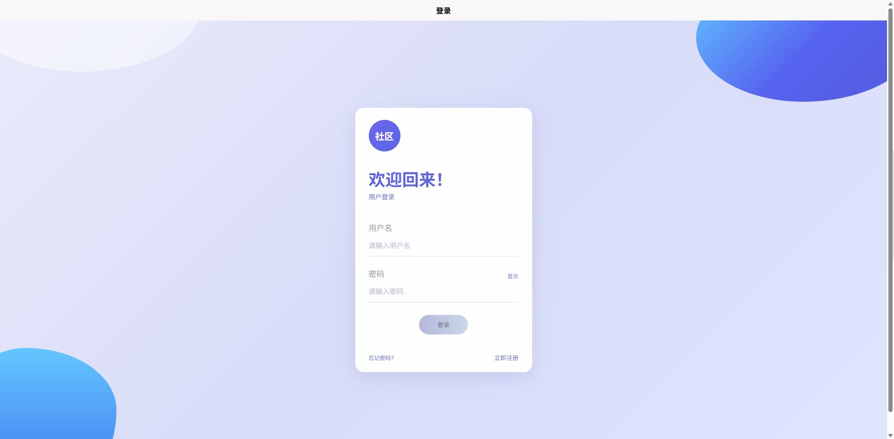
    </td>
    <td width="50%" align="center">
      <b>首页仪表盘</b>
      <br/><sub>物业通知、快捷入口、数据概览</sub>
      <br/><br/>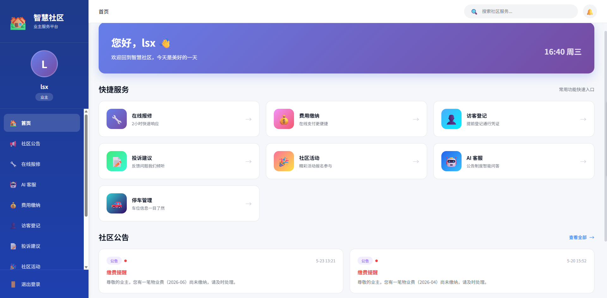
    </td>
  </tr>
  <tr>
    <td width="50%" align="center">
      <b>停车管理</b>
      <br/><sub>车辆绑定、车位详情、余额充值</sub>
      <br/><br/>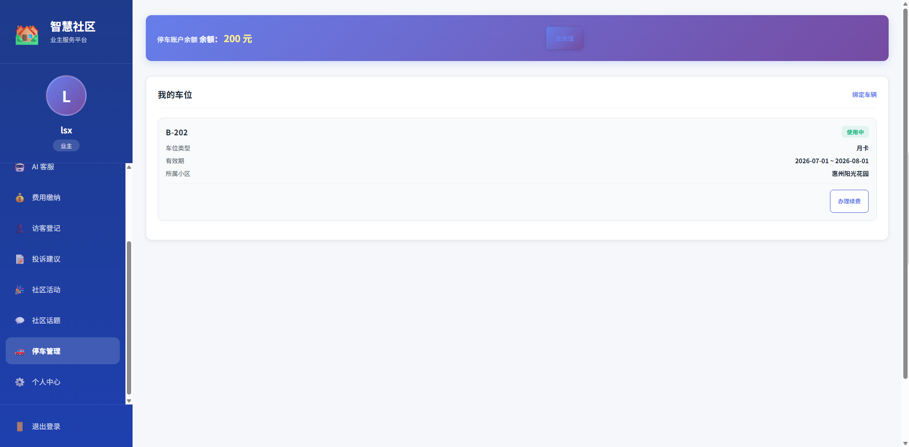
    </td>
    <td width="50%" align="center">
      <b>社区活动</b>
      <br/><sub>活动浏览、在线报名</sub>
      <br/><br/>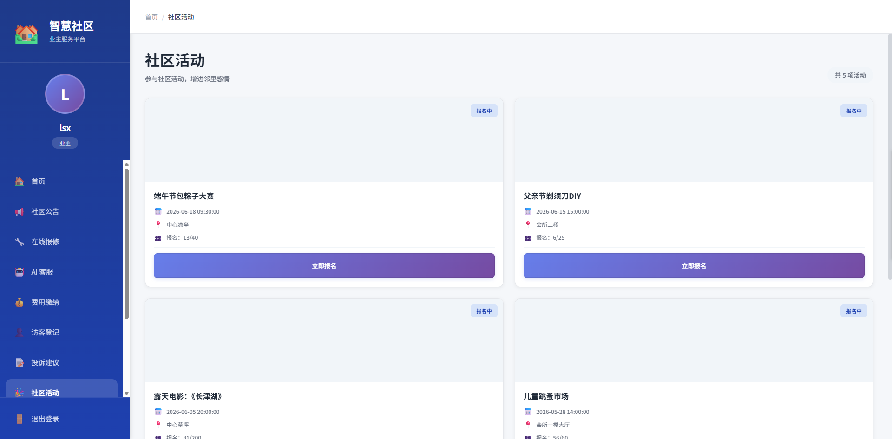
    </td>
  </tr>
  <tr>
    <td width="50%" align="center">
      <b>AI 智能客服</b>
      <br/><sub>社区问题咨询、RAG 混合检索回答</sub>
      <br/><br/>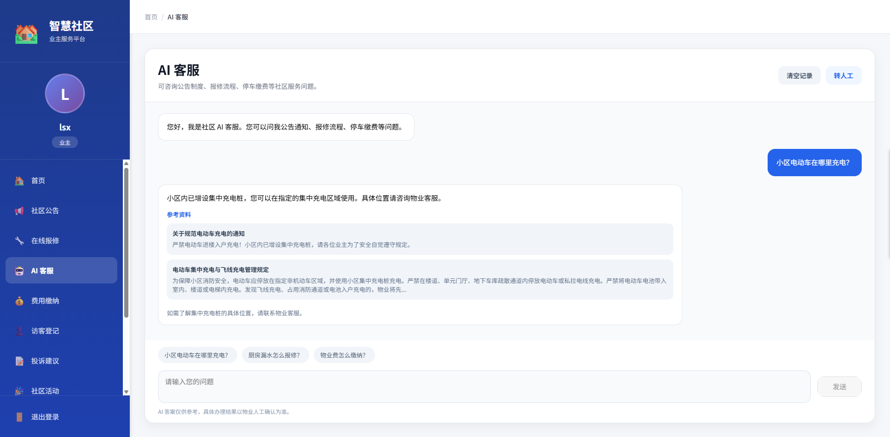
    </td>
  </tr>
</table>

### 管理员端

<table>
  <tr>
    <td width="50%" align="center">
      <b>物业端仪表盘</b>
      <br/><sub>缴费管理、投诉处理、公告发布、访客登记</sub>
      <br/><br/>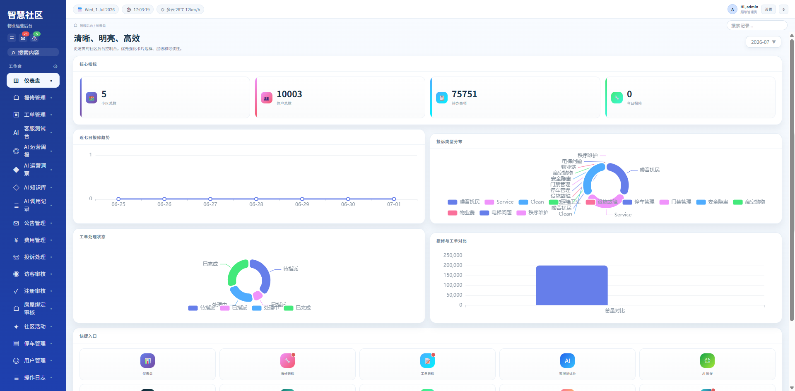
    </td>
    <td width="50%" align="center">
      <b>工单管理</b>
      <br/><sub>报修工单列表、派单、进度跟踪</sub>
      <br/><br/>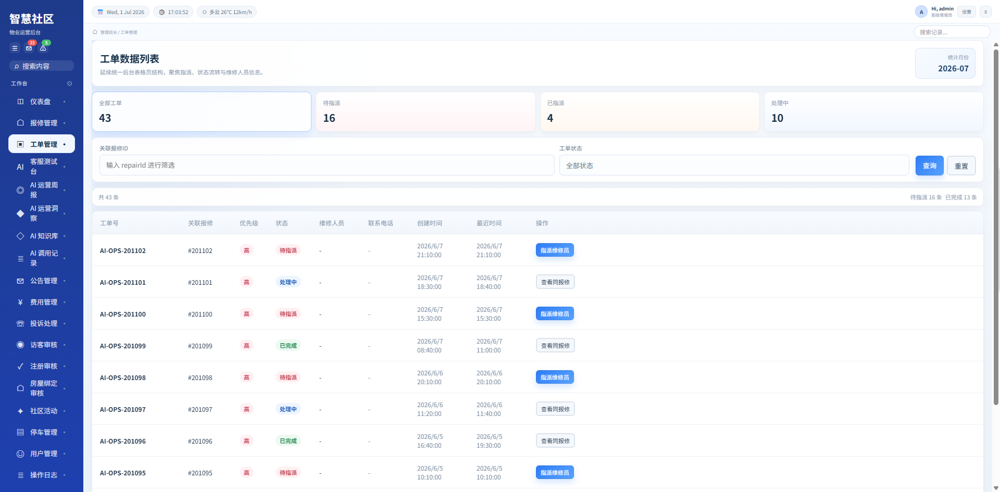
    </td>
  </tr>
  <tr>
    <td width="50%" align="center">
      <b>活动管理</b>
      <br/><sub>活动发布、报名审核、签到管理</sub>
      <br/><br/>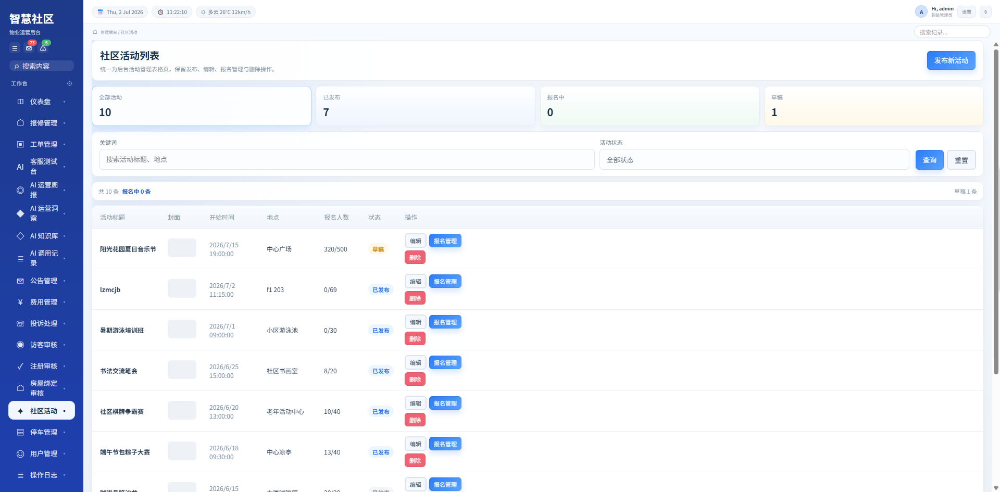
    </td>
    <td width="50%" align="center">
      <b>运营洞察</b>
      <br/><sub>多维度指标 → AI 风险识别 + 趋势预警</sub>
      <br/><br/>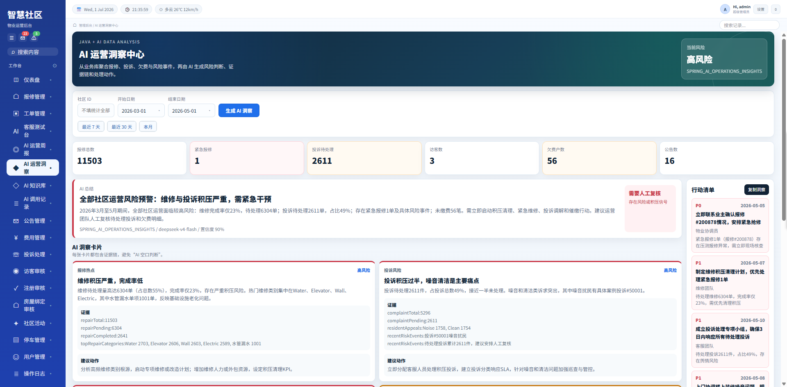
    </td>
  </tr>
  <tr>
    <td width="50%" align="center">
      <b>运营周报</b>
      <br/><sub>自动聚合数据 → AI 生成周报</sub>
      <br/><br/>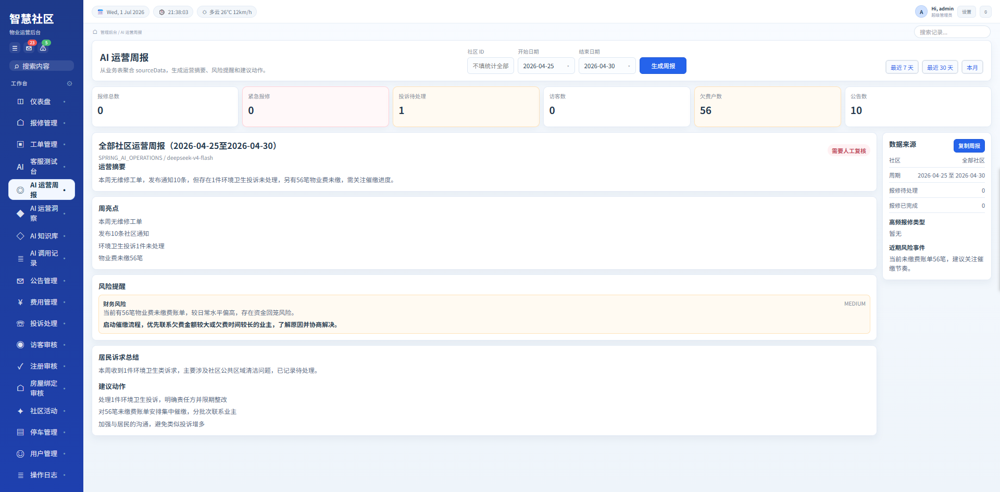
    </td>
    <td width="50%" align="center">
      <b>知识库管理</b>
      <br/><sub>知识文档 CRUD、Embedding 向量化</sub>
      <br/><br/>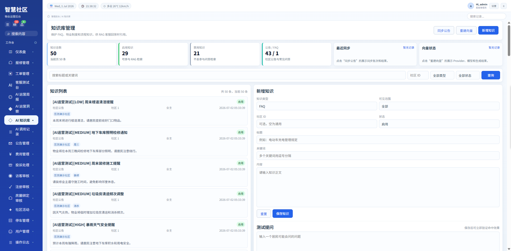
    </td>
  </tr>
  <tr>
    <td width="50%" align="center">
      <b>系统管理</b>
      <br/><sub>用户管理、操作日志、权限控制</sub>
      <br/><br/>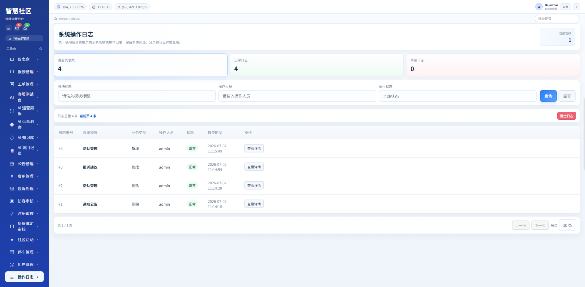
    </td>
  </tr>
</table>

---

## 项目结构

<details>
<summary>点击展开完整目录树</summary>

```
smart-community-ai-version/
├── gateway-service/         # API 网关（路由转发、Sentinel 限流）
├── common-module/           # 公共模块（JWT、Redis 锁工具、MQ 常量）
├── user-service/            # 用户服务
├── house-service/           # 房屋服务
├── parking-service/         # 停车服务（车位管理、道闸出入、计费）
├── property-service/        # 物业服务（缴费、投诉、公告、访客）
├── workorder-service/       # 工单服务
├── community-service/       # 社区互动（活动报名）
├── system-service/          # 系统管理（日志、统计、配置）
├── ai-service/              # AI 智能服务（Spring Boot 3.5 + Java 17）
│   ├── customer/            #   RAG 智能客服
│   ├── workorder/           #   工单智能分析
│   ├── operations/          #   运营洞察 & 周报
│   ├── knowledge/           #   知识库管理 & Embedding
│   └── observability/       #   AI 调用可观测性
├── nacos_config/            # Nacos 配置文件
├── sql/                     # 数据库初始化 SQL
├── nginx/                   # Nginx 前端配置
├── scripts/                 # 开发辅助脚本
├── docker-compose.yml       # 一键启动全部服务
└── docker-compose.infra.yml # 仅启动中间件
```

</details>

---

## 技术栈

| 层级 | 技术 |
|---|---|
| 框架 | Spring Boot 2.7.18 / 3.5.14（AI 模块） + Spring Cloud Alibaba 2021.0.5.0 |
| 注册 & 配置中心 | Nacos |
| 网关 | Spring Cloud Gateway + Sentinel 限流 |
| 数据库 | MySQL 8.0 |
| 缓存 & 锁 | Redis 6.2 |
| 消息队列 | RabbitMQ 3.9 |
| AI 模型 | DeepSeek V4（通过 Spring AI 调用） |
| 容器化 | Docker + Docker Compose |

---

## AI 模块能力一览

| 模块 | 端点 | 功能 |
|---|---|---|
| RAG 智能客服 | `POST /api/ai/community/customer-service/ask` | 混合检索 → DeepSeek 回答 → Normalizer 校验 |
| 工单智能分析 | `POST /api/ai/workorder/analyze` | 结构化分类 + 优先级校准 + 高危词判定 |
| 运营洞察 | `GET /api/ai/operations/insights` | 运营指标 → AI 风险洞察 + 规则兜底 |
| 运营周报 | `GET /api/ai/operations/weekly-report` | 指标聚合 → AI 周报 + 模板兜底 |
| 知识库管理 | `CRUD /api/ai/knowledge/documents` | 知识文档管理、Embedding 重建 |

---

## 关键技术点

- **RAG 混合检索**：关键字匹配 + 向量余弦相似度，加权合并
- **Lua 脚本原子操作**：报名接口用 Lua 将查重、初始化库存、扣库存、标记用户合并为一次 Redis EVAL
- **Normalizer 输出校验**：模型回答后白名单过滤 citations、限幅 confidence、补全空字段
- **TransactionTemplate 先锁后事务**：出闸接口改编程式事务，消除分布式锁与 @Transactional 的间隙
- **Fallback 降级策略**：AI 不可用时自动切换规则引擎保底输出
- **定时缓存预热**：车位余量每 5 分钟主动刷入 Redis
- **AI 可观测性**：每次大模型调用记录 bizType、耗时、token 消耗、成功/降级/失败状态

---

## 快速启动（Docker Compose）

### 前置要求

- Docker & Docker Compose
- DeepSeek API Key（AI 模块需要，[申请地址](https://platform.deepseek.com)）

### 1. 配置环境变量

```bash
cp .env.example .env
```

编辑 `.env` 文件，填入你的配置：

```ini
# 数据库和中间件密码（本地开发可用默认值）
MYSQL_ROOT_PASSWORD=1234
REDIS_PASSWORD=1234

# JWT 签名密钥（任意长字符串）
JWT_SECRET=mySecretKeyForJWTGenerationInSmartCommunitySystem2024

# AI 模块（必填）
AI_OPENAI_API_KEY=你的DeepSeek_API_Key
```

### 2. 一键启动

```bash
docker-compose up -d
```

首次启动会自动完成：
- 拉取 MySQL、Redis、Nacos、RabbitMQ 镜像
- 构建 8 个业务服务镜像
- 自动建表（`sql/smart_community.sql` 包含全部表结构）
- 启动所有服务

### 3. 访问

| 服务 | 地址 |
|---|---|
| 网关（前端入口） | http://localhost |
| Nacos 控制台 | http://localhost:8848/nacos（账号 nacos/nacos） |
| AI 服务 | http://localhost:8090 |
| Sentinel 控制台 | 需单独部署 |

---

## 手动启动（开发模式）

如果你不想用 Docker 跑业务服务，只启动中间件，然后 IDE 里调试：

### 1. 启动中间件

```bash
docker-compose -f docker-compose.infra.yml up -d
```

### 2. 导入 Nacos 配置

Nacos 启动后，创建 `core-service.yaml`（DEFAULT_GROUP），内容参考 `nacos_config/core-service.yaml`。

### 3. 设置 IDE 环境变量

```
MYSQL_PASSWORD=1234;REDIS_PASSWORD=1234;JWT_SECRET=mySecretKeyForJWTGenerationInSmartCommunitySystem2024
```

### 4. 按顺序启动服务

```
Gateway → System → User → House → Property / Workorder / Parking / Community → AI
```

AI 服务用 Java 17，其他服务用 Java 8。

---

## 端口说明

| 服务 | 端口 |
|---|---|
| Nginx / Gateway | 80 |
| AI Service | 8090 |
| Nacos | 8848 |
| Sentinel | 8858 |
| RabbitMQ | 5672（管理面板 15672） |
| MySQL | 3306 |
| Redis | 6379 |
